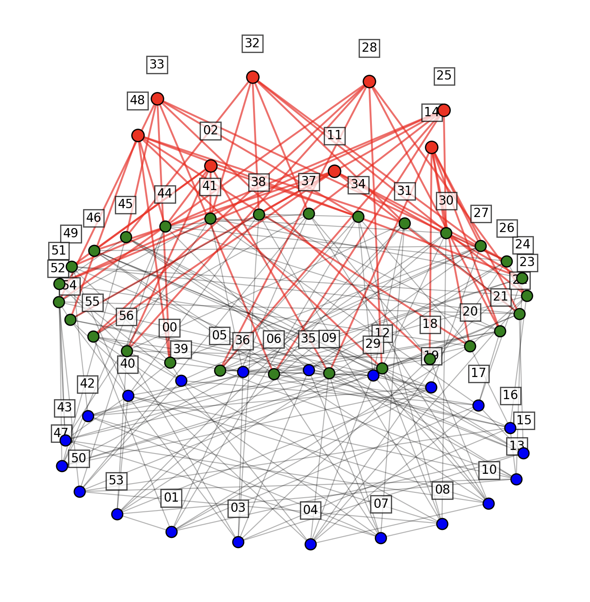

## polarfly

This project is setup to model Polarfly topologies of various size and in some cases has containerlab topology definitions and config files to them. For example the radix 8 Polarfly topology results in a 57 node single tier network. In the case of larger topologies, the Containerlab VXLAN tool may be used to connect nodes across host servers or VMs.

### Topology generator
Use the topogen/pf-viz.py tool (Thank you Christian Martin!) to generate a Polarfly topology including diagrams and a table listing nodes, their category, and their connections.

```
cd topogen
python3 pf-viz.py -q 7
```




#### json output
Run the pf-viz.py tool with the --json flag to generate json files with the vertices and edges of the topology.

```
python3 pf-viz.py -q 7 --json
```

### ArangoDB import tool

Use the topogen/upload_to_arango.py tool to upload the vertices and edges of the topology to an ArangoDB database.

```bash
python3 upload_to_arango.py \
  --url http://localhost:8529 \
  --username myuser \
  --password mypassword \
  --db polarfly_db \
  --vertices polarfly_q7_vertices.json \
  --edges polarfly_q7_edges.json
```


## Building a 57-node Radix 8 Polarfly Topology with Containerlab and XRd

The following instructions assume deployment of the 57 nodes across a pair of servers or large VMs. If you've got enough vCPU and memory you could deploy all 57 nodes on a single server or VM.

Requirements:

Two servers or large VMs with 32 vCPU and 96GB RAM each.
Docker andContainerlab

### Instructions:

Note: steps 1-8 should be performed on both servers or VMs.

1. Clone this repository

2. Install Containerlab: https://containerlab.dev/install/

3. Acquire a Cisco XRd or other dockerized router image

4. Load docker image
```
docker load -i <image_name>
```

5. Modprobe
```
sudo modprobe br_netfilter
```

6. Add the following to /etc/sysctl.conf
```
kernel.pid_max=1048575
net.vrf.strict_mode=1
net.ipv4.ip_forward=1
net.ipv6.conf.all.forwarding=1

fs.inotify.max_user_watches = 131072
fs.inotify.max_user_instances = 131072
net.bridge.bridge-nf-call-iptables = 1
net.bridge.bridge-nf-call-ip6tables = 1
kernel.pid_max = 1048575
```

7. Apply sysctl changes
```
sudo sysctl -p
```

8. Determine which server/VM will host the lower half of the topology (nodes00 - nodes28) and which will host the upper half (nodes29 - nodes57). 

#### Lower half of the topology
1. ssh to the server/VM that will host the lower half of the topology and cd into the radix-8-xrd directory then:
    
Deploy lower nodes:
```
sudo clab deploy -t polarfly-lower.yml
```

2. Run vxlan interconnect script for lower nodes:
```
sudo util/vxlan-lower.sh
```

3. As of clab 1.60 there appears to be a bug where some netns interfaces get incorrectly wired. Run the 'fix-ints.sh' script to correct this.
```
sudo util/fix-ints.sh
```

#### Upper half of the topology
1. ssh to the server/VM that will host the upper half of the topology and cd into the radix-8-xrd directory then:

Deploy upper nodes:
```
sudo clab deploy -t polarfly-upper.yml
```

2. Run vxlan interconnect script for upper nodes:
```
sudo util/vxlan-upper.sh
```

3. Run the 'fix-ints.sh' script to correct any incorrectly wired netns interfaces.
```
sudo util/fix-ints.sh
```

#### Both lower and upper halves:
1. Give the routers 3-4 minutes to launch, then verify
2. ssh to routers. Example:
```
ssh cisco@clab-polarfly-radix8-node55
password: cisco123
```

### srctl command line tool

1. clone srctl tool:
```
git clone https://github.com/jalapeno/srctl.git
```

2. install srctl:
```
cd srctl
pip install -e .
```

3. srctl example commands:
```
export JALAPENO_API_SERVER=http://198.18.133.102:30800
srctl get-paths -s ebgp_prefix_v6/fc00:0:701:805::_64 -d ebgp_prefix_v6/fc00:0:701:9::_64 --type best-paths --limit 9
```

```
export JALAPENO_API_SERVER=http://198.18.133.102:30800
srctl get-paths -f srctl/get-best-paths.yaml --limit 8
```

Example output:
```yaml
cisco@topology-host:~/polarfly$ srctl get-paths -f srctl/get-best-paths.yaml --limit 8
Loaded configuration from srctl/get-best-paths.yaml

example:
  Path 1 SRv6 uSID: fc00:0:1004:1021:1023:
  Path 2 SRv6 uSID: fc00:0:1004:1005:1020:1023:
  Path 3 SRv6 uSID: fc00:0:1004:100c:1022:1023:
```