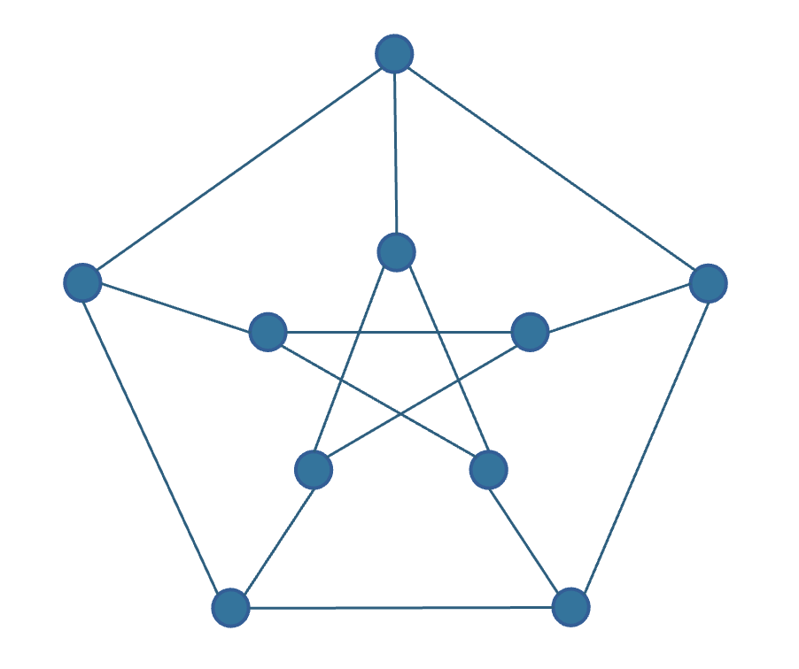
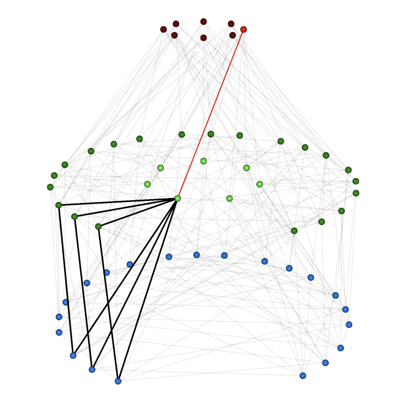
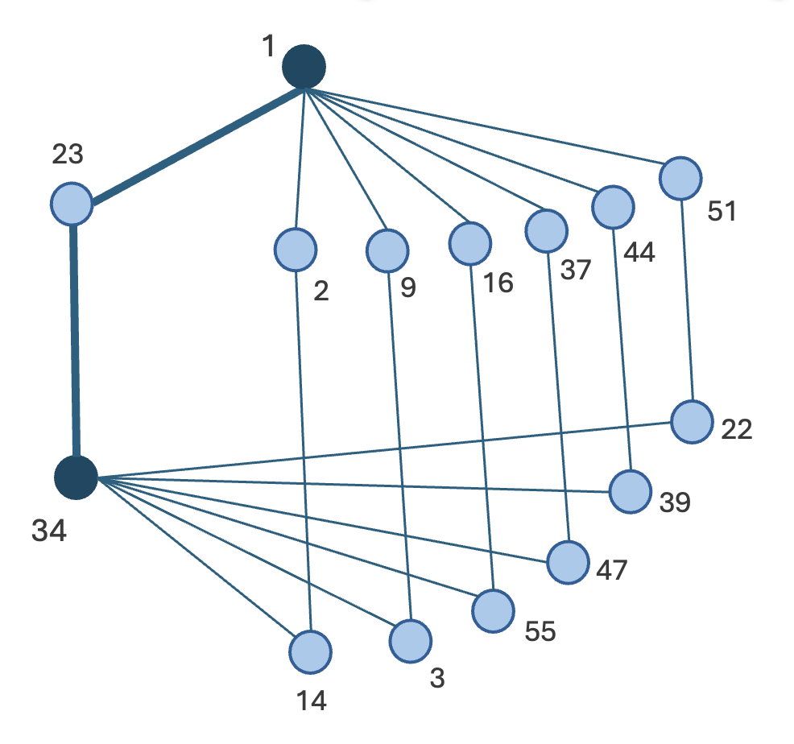

# WMP-PolarFly: Weighted Multipath Routing on Algebraically Optimal Low-Diameter Datacenter Topologies

**Author:** Bruce McDougall, Cisco Systems
**Co-author:** Christian Martin, Cisco Systems
**Status:** DRAFT v1.0
**Date:** September 2026

---

## Abstract

Low-diameter topologies offer a compelling alternative to Clos fat trees for datacenter fabrics by eliminating spine layers and reducing switch count, optics, and per-bit power consumption. However, their adoption has been blocked by practical considerations around cabling complexity, lack of shortest-path (ECMP), and the k-shortest-path routing techniques that could compensate cannot be realized on commodity switch ASICs.

This paper presents **WMP-PolarFly**, a routing architecture that resolves this objection for the PolarFly topology. WMP-PolarFly uses SRv6 uSID source routing to steer traffic across a source-destination pair's **shortest path (SP)** and **next-shortest-paths (NSPs)** with algebraically derived weights. The SP and NSP set is computed directly from the PolarFly graph's projective-plane coordinates. This means no path-computation protocol, no topology probing, and no transit forwarding state is needed beyond plain LPM. We present deployment configurations spanning native high-bandwidth fabric links for MRC-based AI training clusters, multi-slice partitioning for greater entropy in general-purpose cloud, and physically separate PolarFly planes for first-hop switch redundancy. We compare WMP-PolarFly against Clos fat trees, Amazon's RNG random-graph architecture, and the Spritz sender-based load-balancing framework, and demonstrate that WMP-PolarFly matches or exceeds each on switch count, optics, and per-bit cost while delivering deterministic diameter-2 latency on open standards deployable today.

---

## 1. Introduction

### 1.1 The Clos scaling problem

Clos fat trees have dominated datacenter fabric design for over a decade, and for good reason: they provide non-blocking, high-bisection-bandwidth connectivity with a clean hierarchical structure. But that hierarchy comes at a cost. Spine and super-spine switches do not directly serve endpoints, they exist purely to aggregate and redistribute traffic. In a 3-tier Clos, roughly one-third of all switches and half of all fabric optics are consumed by these transit layers. Capacity is stranded structurally, and the cost scales superlinearly with endpoint count.

### 1.2 Low-diameter topologies as alternatives

Flat topologies — direct switch-to-switch interconnects with no aggregation layers — have promised an escape from the Clos cost curve for over a decade. The key insight: if every switch serves both endpoints and fabric, no switch is "wasted" on pure transit. Examples include Jellyfish [12], which first demonstrated that random regular graphs could match Clos throughput at lower cost, Slim Fly [5] and Xpander [6] showed that structured graphs could approach theoretical efficiency limits, and PolarFly [2] achieved the first asymptotic match to the Moore bound at diameter 2 — the theoretical maximum number of nodes for a given degree and diameter.

**Figure 1**: *The 10 node Peterson Graph is an intuitive low-diameter topology showing how any node can reach any other non-directly connected node via a single two-hop shortest path* 

The common obstacle: these topologies provide far fewer equal-cost shortest paths per endpoint pair than a Clos, starving standard ECMP of the path entropy it needs for effective load balancing. Prior solutions required either HPC-class adaptive routing hardware (UGAL) or abandoning structured topologies entirely in favor of random graphs (RNG/Spraypoint)[1]. This paper demonstrates a third path: SRv6 source routing on PolarFly, exploiting the topology's algebraic structure to derive weighted multipath forwarding from endpoint coordinates alone.

### 1.3 Contributions

This paper makes four contributions:

1. **WMP-PolarFly architecture**: a weighted multipath routing design where the shortest path (SP) and next-shortest-paths (NSPs) are derived algebraically from PolarFly's projective-plane coordinates, with SRv6 uSID encapsulation concentrating path state at the encap node while transit switches carry only O(n) LPM entries.

2. **Deployment configuration analysis**: an honest examination of native high-bandwidth links versus multi-slice breakout, showing that slicing adds path diversity (valuable for flow-level ECMP) but not bandwidth (each adjacency carries the same aggregate regardless of breakout), and that MRC-based backends benefit from fewer, fatter links while general-purpose cloud fabrics benefit from multi-slice SP redundancy.

3. **MRC integration**: a synthesis showing that PolarFly's algebraically enumerable path sets map naturally onto MRC's Entropy Value (EV) abstraction, enabling per-packet spraying with congestion-aware adaptive weighting on commodity Ethernet.

4. **Comparative analysis**: quantitative comparisons against Clos, RNG, and Spritz at matched endpoint populations, demonstrating 35–61% switch-count savings versus Clos, matched economics versus RNG with half the hop count, and algebraic path certainty versus Spritz's probe-based discovery.

### 1.4 Paper organization

Section 2 presents PolarFly's topology foundations and the path diversity challenge. Section 3 develops the WMP-PolarFly architecture. Section 4 analyzes deployment configurations. Section 5 addresses resilience. Section 6 examines deployment scenarios for both AI backend and general-purpose cloud. Section 7 provides comparative analysis against Clos, RNG, and Spritz. Section 8 concludes.

A practical note: while Amazon's RNG is production-proven, it is not publicly available. The Spraypoint protocol has not been open-sourced and they leverage in-house designed ShuffleBoxes that are not commercially available. WMP-PolarFly builds on open-source components (FRR, SONiC), Ethernet, and standard SRv6 (RFC 8986 [8], RFC 9256 [7]), and is deployable today.

---

## 2. PolarFly Topology Foundations

### 2.1 Construction and properties

PolarFly [2] is defined by a single parameter q, which must be an odd prime or odd prime power. From q, three properties follow directly:

N = q² + q + 1 — the number of switches in the fabric
Fabric degree = q + 1 — the number of fabric-facing ports per switch
Diameter = 2 — the maximum number of hops between any two switches

The topology is the Erdős–Rényi polarity graph ER_q over the projective plane PG(2, q). Each switch is assigned a projective coordinate, a 3-tuple (a, b, c) over the finite field GF(q), and two switches are directly connected if and only if their coordinates are orthogonal: a₁a₂ + b₁b₂ + c₁c₂ ≡ 0 (mod q).

For example, with q = 7 on a 16-port switch, 8 ports serve the fabric (degree q+1 = 8) and 8 serve endpoints, yielding a fabric of 7² + 7 + 1 = 57 switches from just 8 fabric uplinks each. PolarFly asymptotically reaches the Moore bound, the theoretical maximum node count for a given degree and diameter, exceeding 96% efficiency at practical radixes and 99% at q = 127. It is the most scale-efficient diameter-2 topology known. (See Appendix A for the odd-prime-power constraint and feasible-degree lattice.)

**Figure 2**: *A 57 node q = 7 diameter Polarfly topology*

PolarFly image credit Lakhotia, et al.

The following table shows PolarFly fabric sizes at selected values of q:

**Table 1**

| q | Type | Switches (q²+q+1) | Fabric degree (q+1) |
|---|---|---|---|
| 7 | prime | 57 | 8 |
| 31 | prime | 993 | 32 |
| 61 | prime | 3,783 | 62 |
| 127 | prime | 16,257 | 128 |
| 251 | prime | 63,253 | 252 |

### 2.2 The path diversity inversion

PolarFly's efficiency comes from a structural property: **no two switches share more than one common neighbor**. This is what maximizes scale; edges are never wasted on redundant two-hop paths, but it creates a routing challenge: between most non-adjacent switch pairs, there is only **one** shortest (2-hop) path. In networking terms, imagine a fabric where every source-destination pair has exactly one spine to traverse, with no second equal-cost path to hash onto.

This creates an irony: the property that makes PolarFly the most efficient topology simultaneously starves it of the shortest path redundancy that ECMP depends on. **Optimality and path diversity are structurally in tension**: the closer a topology sits to the Moore bound, the fewer shortest paths it can offer per pair.

### 2.3 Routing approaches for low-diameter topologies

Four approaches have been proposed to address the path diversity challenge on low-diameter topologies, forming a spectrum from topology-integrated to endpoint-driven:

**UGAL / in-network adaptive routing.** Switches sense congestion in real time and deflect traffic from congested shortest paths onto longer non-minimal paths. This is the standard approach in the HPC Dragonfly and Slim Fly lineage. It requires adaptive-routing hardware that commodity Ethernet ASICs generally do not provide, though certain implementations on standard hardware may be feasible in constrained settings.

**RNG / Spraypoint (topology randomness).** Amazon's RNG abandons structured topologies entirely, using quasi-random graphs where the randomness of the wiring provides path diversity natively. The Spraypoint protocol sprays flows across the full neighbor set using standard ECMP, with traffic converging on the destination through waypoint nodes. The cost is path length: typically 4–5 hops versus PolarFly's diameter of 2, which is accepted in exchange for diversity and statelessness.

**Spritz (endpoint probing).** Bonato et al.'s Spritz [13] moves adaptive routing to the endpoint on commodity Ethernet, using ECN, packet trimming, and timeout feedback to probe and cache efficient paths. The Spritz-Scout algorithm explores paths dynamically; Spritz-Spray distributes traffic across discovered paths. Spritz is topology-agnostic; it discovers what works without needing to know the graph structure.

**WMP-PolarFly (algebraic derivation).** The approach presented in this paper: the endpoint derives all paths from the source and destination's projective coordinates using finite-field arithmetic, programs them as SRv6 segment lists, and distributes traffic with explicit weights. No probing, no in-network adaptation, no path-computation protocol required. The path set is a mathematical certainty, not a discovery.

These four approaches solve the same problem with different assumptions about what the operator controls and what guarantees they receive in return. UGAL delivers real-time adaptivity but requires switch hardware most Ethernet ASICs lack. RNG achieves diversity through topology design but requires a custom protocol (Spraypoint) that is not publicly available. Spritz works on commodity Ethernet without topology knowledge, but must discover paths empirically before reaching steady state. WMP-PolarFly requires SRv6 encapsulation and coordinate assignment, but in return delivers deterministic paths with zero discovery latency and no in-network state beyond plain LPM. The remainder of this paper develops WMP-PolarFly's architecture and evaluates it against the alternatives.

---

## 3. The WMP-PolarFly Architecture

### 3.1 SP and NSP definition

For a given source-destination pair in a PolarFly fabric with parameter q:
// this is for non-directly connected source-dest pair, correct?

- The **shortest path (SP)** is the unique 2-hop path through the pair's single shared neighbor: the relay node.
- The **next-shortest-paths (NSPs)** are 3-hop paths through intermediate nodes that are not the relay and whose paths do not share an edge with the SP. Each non-relay neighbor of the source can provide one edge-disjoint NSP, except when that neighbor is adjacent to the relay (forming a triangle whose candidate path would reuse the SP's final edge). This yields **q−1 NSPs for most pairs**, with a minority yielding q NSPs when no such triangle occurs.

**Figure 3**: *Node-1 to Node-34 in a 57-node q = 7 fabric - one Shortest-Path (SP) and Six Next-Shortest-Paths (NSPs)*

For q = 7: **1 SP + 6 NSPs = 7 total forwarding paths** for most pairs. For q = 31: 1 SP + ~30 NSPs. For q = 127: 1 SP + ~126 NSPs. The path count grows linearly with q, providing increasingly rich entropy at larger fabric scales.

### 3.2 Algebraic path derivation

The property that distinguishes WMP-PolarFly from generic source routing: **the SP and NSP set is algebraically derivable from endpoint coordinates**.

The SP relay between two non-adjacent nodes with coordinates A and C is the cross product A × C in GF(q) — a single finite-field computation yielding the relay's coordinates directly. The NSPs are enumerated by iterating over A's remaining neighbors (excluding the relay and any triangle-adjacent neighbor) and computing their common neighbor with C.

**Worked example (q = 7).** Every switch has a 3-digit mod-7 address. Router A = (1, 0, 2) wants to reach C = (1, 4, 6). They are not adjacent (dot product = 6 ≠ 0). The SP relay B is the cross product: B = A × C mod 7, yielding one canonical projective point. The encap node emits the SRv6 segment list [uSID-B, uSID-C]. The same arithmetic enumerates 6 NSPs, each through a different first-hop neighbor, producing 6 additional three-SID segment lists.

**Control-plane consequence:** no path-computation protocol is required. A routing protocol such as ISIS or BGP may be used to distribute node-SIDs and BFD may be used to provide liveness detection, but path discovery/calculation, the function of RSVP-TE, PCE, or CSPF, is eliminated entirely. A simple SDN controller or even a local software agent on the encap node can synthesize the full SP + NSP segment-list set from the destination's coordinates alone.

### 3.3 SRv6 uSID encapsulation and state economics

SRv6 uSID is what makes WMP-PolarFly viable on commodity hardware. Each SP (2-hop) and NSP (3-hop) fits within a single uSID carrier with no SRH required. Path state concentrates at encapsulation nodes as O(k·n) segment lists in host or SmartNIC policy memory, while the transit FIB holds only the node-SID table and uA adjacency table: O(n), in plain LPM.

The contrast with tunnel-based k-shortest-path routing is significant. In a tunnel-based implementation, each path through each transit router consumes one or more forwarding entries for label mappings, next-hop associations, and adjacency state. Even at a conservative estimate of one entry per path per router, q = 61 (3,783 switches, ~61 paths per destination) requires 61 × 3,783 ≈ 231K forwarding entries per router, approaching the >300K IPv6 ALPM capacity of a Broadcom Tomahawk 5. Realistic implementations require multiple entries per path, pushing the total well beyond ASIC limits. At q = 127 the problem compounds to over a million entries regardless of the multiplier. SRv6 uSID bypasses the problem entirely: the transit FIB holds ~4K entries at q = 61 or ~16K at q = 127 (see Table 1), regardless of how many paths the encap node programs.

### 3.4 WMP weight computation

Traffic splits across the SP and NSP segment lists with explicit weights. The SP is more efficient (2 hops vs. 3), so it receives a premium, but the premium shrinks as q grows and the SP becomes one path among many.

At q = 7 (7 paths): a 30% SP, ~12% per NSP split would be a reasonable place to start. At q = 127 (~127 paths): weights converge toward near-uniform, and the operator may treat all paths as ECMP. The weight is a derived function of q and hop-count ratio, not a constant — though operators can override it for specific traffic patterns.

The NIC computes segment lists on demand from coordinates and caches them for active connections. For each unique destination node, the NIC holds one SP + ~(q−1) NSP segment lists. At q = 61 this is ~61 segment lists per destination. A NIC with active connections to 1,000 distinct remote nodes (whether TCP, UDP, or RDMA QPs) would cache ~61K segment lists, well within the memory capacity of modern DPUs and SmartNICs (ConnectX, Pollara, and similar). Multiple connections to the same destination node reuse the same cached segment-list set.

### 3.5 Live-vertex-set adaptation

In a partially deployed fabric, the SP relay between a live pair may not yet be installed. The encap node detects this from the installed-coordinate set and re-derives weights over the realized subgraph with no protocol convergence required. This conditional weighting over the realized subgraph is, to our knowledge, novel, and enables PolarFly's purely additive expansion model: new switches land and patch into pre-planned positions, and the encap nodes algebraically recompute paths to incorporate them.

---

## 4. Deployment Configurations

A 51.2T switch ships as a 64×800G device. It can be deployed at native port speeds, broken out to 128×400G, or further broken out to 512×100G. The choice between these modes determines the PolarFly configuration and has significant implications for cabling complexity, path diversity, and which deployment scenarios benefit.

A key observation: **slicing adds path diversity but not bandwidth.** In a 4-slice q=61 configuration at 512×100G, each inter-switch adjacency is 4×100G = 400G (one link per slice). In a native q=61 configuration at 128×400G, each adjacency is 1×400G — the same aggregate bandwidth. The slices provide multiple independent SPs per pair (valuable for flow-level ECMP), but no additional capacity between any switch pair.

### 4.1 Native high-bandwidth links (MRC backend)

For AI training clusters using MRC, the optimal configuration minimizes cabling while maximizing per-link bandwidth: native 400G or 800G fabric links, no breakout, no slicing.

| Configuration | Link speed | Fabric ports | Server ports | Switches | Server attachment |
|---|---|---|---|---|---|
| q=61, 128×400G | 400G | 62 | 66 | 3,783 | 66 × 400G per switch |
| q=31, 64×800G | 800G | 32 | 32 | 993 | 32 × 800G per switch |

MRC handles path diversity at the transport layer: per-packet spraying across the 1 SP + ~(q−1) NSPs within a single PolarFly graph, with NSCC congestion feedback adapting weights dynamically. The switch can serve 100G NIC connections from its 400G or 800G server-facing ports via standard breakout on the server side only — no fabric breakout required.

Cabling is straightforward: one physical fiber per adjacency, q+1 fibers per switch. At q=61 this is 62 fabric fibers per switch — clean enough for structured patch frames.

### 4.2 Multi-slice for flow-level redundancy (general cloud)

For general-purpose cloud fabrics running TCP without MRC, flow-level ECMP is the primary load-balancing mechanism. Multiple SPs per pair — one per slice — give the flow hash more equal-cost options:

| Configuration | Link speed | Fabric ports | Server ports | Switches | SPs per pair | Total paths |
|---|---|---|---|---|---|---|
| 4-slice q=61, 512×100G | 100G | 248 (4×62) | 264 | 3,783 | 4 | 4 + ~240 |
| 4-slice q=31, 512×100G | 100G | 128 (4×32) | 384 | 993 | 4 | 4 + ~120 |
| 8-slice q=31, 512×100G | 100G | 256 (8×32) | 256 | 993 | 8 | 8 + ~240 |

At 4-slice q=31 the server-to-fabric ratio is 384:128 = 3:1 — matching the standard cloud oversubscription point.

**Slice isolation** is enforced by the SRv6 data plane: each slice's paths use distinct uA (adjacency) SIDs bound to specific physical interfaces, so a segment list for slice-2 resolves at each transit hop to the slice-2 egress link. Operators who prefer maximum path diversity over strict failure-domain isolation can relax this binding and let the encap node spray across all slices as a wider path set.

### 4.3 Physically separate PolarFly planes (MRC multi-plane)

For deployments requiring first-hop switch redundancy — analogous to the multi-plane Clos architecture used in production MRC clusters — multiple physically separate PolarFly fabrics serve as independent planes:

| Configuration | Planes | Switches/plane | Total switches | GPUs (at 4×100G) | Physical redundancy |
|---|---|---|---|---|---|
| 2 planes × 8-slice q=31 | 2 | 993 | 1,986 | 127K | 2-way |
| 4 planes × 8-slice q=31 | 4 | 993 | 3,972 | 127K | 4-way |

Each GPU's NIC is broken out to N×100G with each 100G connecting to a different physical plane's local switch. A switch failure in one plane affects only that plane's NIC connections — the remaining planes continue serving traffic. Within each plane, MRC sprays across 8 SPs + ~240 NSPs per pair.

This layering — physical planes for switch-level fault isolation, logical slices for path diversity within each plane — provides the full redundancy stack: hardware failure domains via physical separation, path diversity via algebraic slicing, and transport-level resilience via MRC EV probing.

### 4.4 Scale at modern radix

Both the single-fabric and multi-plane configurations exceed the footprint of any known single datacenter building. The 4-slice q=61 configuration serves ~1M endpoints from 3,783 switches; the 2-slice q=127 configuration reaches ~4M endpoints from 16,257 switches at 99% Moore-bound efficiency. The odd-prime-power constraint (Appendix A) excludes powers of 2 from the feasible set of q values, but the lattice of odd primes is dense enough at modern radix that a feasible q lies within a few ports of any target.

---

## 5. Resilience

### 5.1 Single-slice failure model

When a pair's unique SP relay fails in a single-slice PolarFly, traffic undergoes a discrete transition: 2-hop SP traffic shifts to 3-hop NSPs, producing a detectable RTT step. The encap node re-derives weights from the updated live-vertex set algebraically — faster than any IGP reconvergence — but the hop-count transition is observable to congestion control.

### 5.2 Multi-slice failure model

With 4 slices, a single slice's SP failure leaves 3 surviving SPs at identical hop count. There is no RTT transition — only a weight rebalance among same-length paths. This substantially narrows the gap between PolarFly's discrete failure model and the continuous, statistical failure model of random-graph topologies.

### 5.3 MRC transport-level resilience

In MRC deployments, path-level failure handling moves to the transport entirely. MRC's per-path EV probing detects a dead path within one RTT-scale window and stops scheduling packets onto it. On PolarFly this composes with algebraic re-derivation: the NIC masks the failure instantly; the encap layer re-synthesizes the path set from the updated live-vertex set in the background. No IGP convergence sits on the critical path.

### 5.4 Additive expansion

Because PolarFly's complete edge set is known in advance from the algebraic construction, expansion never breaks an existing link. A landing switch patches into q+1 pre-planned positions, and encap nodes algebraically recompute paths to incorporate the new vertex. The live-vertex-aware weight function (Section 3.5) handles partial deployment natively, maintaining WMP correctness throughout the build-out.

---

## 6. Deployment Scenarios

### 6.1 AI backend with MRC

RNG's authors explicitly defer AI training, noting that collective-driven workloads may demand structures that flat random topologies lack. The backend is the deployment type where PolarFly's advantages compound: the fabric is built once at known size, the operator owns the stack end to end, hardware is uniform per build, and per-bit cost compounds directly into training economics.

MRC's three key properties — reorder tolerance, per-path congestion state, and SRv6 path steering — map naturally onto WMP-PolarFly:

**Per-packet spraying.** WMP weights apply per packet rather than per flow, eliminating elephant-flow collision risk. A single MRC connection's load spreads across the full SP + NSP set in proportion to derived weights.

**Algebraic path-set provisioning.** MRC requires each connection to be provisioned with a set of EVs. On PolarFly, this set is computed algebraically at connection setup — no path discovery protocol, no fabric-dependent configuration.

**NSCC adaptive weighting.** The algebraic WMP weights serve as priors, modulated by NSCC's per-path congestion signals. At high q the SP/NSP distinction fades and NSCC drives the weight distribution adaptively.

**SP/NSP latency differential.** The 1–2μs gap between 2-hop SPs and 3-hop NSPs is well within MRC's reorder window. NSCC's per-path RTT tracking adapts naturally, scheduling more aggressively onto faster paths.

### 6.2 General-purpose cloud with TCP

For general-purpose cloud fabrics without MRC, WMP-PolarFly operates at the flow level. Multi-slice configurations (Section 4.2) provide multiple SPs per pair for standard ECMP hashing, while SRv6 WMP steers traffic across the NSP set for additional load balancing beyond what ECMP alone provides.

At 3:1 oversubscription (the standard cloud operating point), a 4-slice q=31 configuration on 512×100G switches serves ~381K endpoints from 993 switches — matching RNG's switch count and optics exactly while delivering 2–3 hop deterministic paths versus RNG's 4–5 hop sprayed paths.

At 1:1 oversubscription, an 8-slice q=31 configuration serves ~254K endpoints from the same 993 switches, with 8 SPs + ~240 NSPs per pair — identical hardware to RNG at matched scale, with half the hop count.

### 6.3 The deployment boundary

The boundary between "cloud" and "backend" deployment types is less sharp than the literature implies. A fixed-footprint cloud datacenter — a sovereign build, a large enterprise private cloud, a neocloud region — shares many characteristics of the deliberate-fabric deployment: known size at build time, operator-owned stack, uniform hardware generation. WMP-PolarFly is a legitimate candidate wherever the operator owns the host stack and can deploy SRv6 encapsulation at the endpoint.

---

## 7. Comparative Analysis

### 7.1 WMP-PolarFly vs. Clos

The spine-elimination argument: a 3-tier Clos dedicates roughly one-third of its switches and half of its fabric optics to spine and super-spine layers that serve no endpoints. PolarFly is flat — every switch serves both fabric and server attachment.

**At 3:1 oversubscription (~381K servers, 512×100G switches):**

| Configuration | Switches | Servers | Fabric optics | Hops |
|---|---|---|---|---|
| **3-tier Clos** | 1,792 | ~393K | 524K | 2–4 |
| **WMP-PolarFly 4-slice q=31** | 993 (−45%) | ~381K | 127K (−76%) | 2–3 |

**At 1:1 oversubscription (~254K servers):**

| Configuration | Switches | Servers | Fabric optics | Hops |
|---|---|---|---|---|
| **3-tier Clos** | 2,560 | ~262K | 1,049K | 2–4 |
| **WMP-PolarFly 8-slice q=31** | 993 (−61%) | ~254K | 254K (−76%) | 2–3 |

### 7.2 WMP-PolarFly vs. RNG

At matched oversubscription on the same switch hardware, WMP-PolarFly and RNG converge to identical switch count and fabric optics — the differentiator is path quality and availability.

**At 3:1 oversubscription:**

| Configuration | Switches | Fabric optics | Paths per pair | Hops |
|---|---|---|---|---|
| **RNG** | 993 | 127K | ~128 edge-disjoint (spray) | 4–5 |
| **WMP-PolarFly 4-slice q=31** | 993 | 127K | 4 SPs + ~120 NSPs | 2–3 |

**At 1:1 oversubscription:**

| Configuration | Switches | Fabric optics | Paths per pair | Hops |
|---|---|---|---|---|
| **RNG** | 993 | 254K | ~256 edge-disjoint (spray) | 4–5 |
| **WMP-PolarFly 8-slice q=31** | 993 | 254K | 8 SPs + ~240 NSPs | 2–3 |

The hardware is indistinguishable; the only differences are hop count (2–3 vs. 4–5), path structure (deterministic algebraic vs. statistical spray), and availability (open standards vs. Amazon-internal).

**MRC backend comparison:**

| Configuration | Switches | GPUs | Fabric optics | Physical redundancy |
|---|---|---|---|---|
| **4-plane Clos (baseline)** | 3,072 | 131K | 1,048K | 4 planes |
| **WMP-PolarFly: 2 planes × 8-slice q=31** | 1,986 (−35%) | 127K | 508K (−52%) | 2 planes |
| **8-plane Clos (baseline)** | 6,144 | 131K | 2,097K | 8 planes |
| **WMP-PolarFly: 4 planes × 8-slice q=31** | 3,972 (−35%) | 127K | 1,016K (−52%) | 4 planes |

### 7.3 WMP-PolarFly vs. Spritz

Spritz [13] (Bonato et al., 2026) is the closest intellectual sibling to WMP-PolarFly: both move routing intelligence to the endpoint on commodity Ethernet, targeting low-diameter topologies. The comparison is illuminating rather than adversarial — they represent opposite ends of the topology-knowledge spectrum:

| Dimension | Spritz | WMP-PolarFly |
|---|---|---|
| Path discovery | Probe-based (ECN, trimming, timeout) | Algebraic (projective coordinates) |
| Topology knowledge required | None — discovers paths empirically | Full — needs coordinate assignment |
| Encapsulation | Standard Ethernet | SRv6 uSID |
| Path certainty | Probabilistic (cached, may be stale) | Deterministic (computed, always valid) |
| Topology scope | Agnostic (Dragonfly, Slim Fly, any) | PolarFly-specific |
| Convergence on failure | Re-probing latency | Algebraic recomputation (instantaneous) |
| Setup latency | Probing time before steady state | Zero (paths computed at connection setup) |
| Hardware dependency | Standard Ethernet NICs | SRv6-capable encap node (NIC/DPU/host) |

Spritz's strength is generality: it works on any low-diameter topology without needing to know the graph structure. WMP-PolarFly's strength is certainty: the path set is a mathematical fact, not a discovery, so there is no probing phase, no stale cache risk, and failure re-derivation is instantaneous. An operator choosing between them is choosing between topology-agnostic flexibility and topology-specific optimality.

### 7.4 Feature comparison

| Dimension | Advantage | RNG | WMP-PolarFly | Notes |
|---|---|---|---|---|
| Scale per port | — | Unbounded n | ~16K ToRs at 2×q=127 | Gap closed at ≥51.2T radix |
| Diameter / latency | WMP-PolarFly | Probabilistic (≈4–5 hops) | Deterministic 2 (L ≈ 2.6) | Gap grows with optics cost |
| Per-bit cost & power | WMP-PolarFly | 9–45% under Clos | Near Moore-bound floor | Advantage increases with bandwidth |
| Path diversity | — | High (spray), non-minimal | 1 SP + ~(q−1) NSPs per slice | Both adequate; different mechanisms |
| Transit ASIC state | WMP-PolarFly | LPM + wide ECMP groups | LPM only; paths in encap memory | Avoids ECMP table pressure |
| Control plane | WMP-PolarFly | Distributed protocol (Spraypoint) | IS-IS/BGP for liveness; paths algebraic | Spraypoint is not public |
| Heterogeneity | RNG | Per-node degree mixing | Uniform per slice | Limited practical advantage |
| Incremental growth | — | Unquantized; break-and-splice | Additive to q ceiling; pre-planned | Different tradeoffs |
| Failure model | — | Continuous, statistical | Discrete → continuous with slicing/MRC | Parity at 4 slices |
| Operational model | RNG | Stateless fabric everywhere | Intelligence at encap node | The irreducible difference |
| Availability | WMP-PolarFly | Amazon-internal | Open standards (SRv6), open NOS | Deployable today |

---

## 8. Conclusions and Future Work

### 8.1 Conclusions

WMP-PolarFly demonstrates that the path-state objection to structured low-diameter fabrics is an artifact of tunnel-based forwarding, not a fundamental limitation. SRv6 uSID moves path state to the encap node; PolarFly's algebraic structure eliminates path-computation protocols; and MRC provides the transport-layer diversity mechanism that completes the architecture for AI training backends.

At matched oversubscription on identical switch hardware, WMP-PolarFly matches RNG on switch count and optics while delivering half the hop count and deterministic diameter-2 latency. Against Clos, WMP-PolarFly eliminates the spine layer entirely, achieving 35–61% switch-count savings and up to 76% optics savings. Against Spritz, WMP-PolarFly trades topology generality for algebraic path certainty — zero probing latency, zero stale-cache risk, and instantaneous failure re-derivation.

The choice between these architectures is driven by operating model: RNG suits elastic fleets where the fabric must absorb daily churn without configuration; Spritz suits operators who want topology-agnostic flexibility on any low-diameter graph; WMP-PolarFly suits operators who own the host stack and are willing to encode topology knowledge at the endpoint in exchange for deterministic optimal performance. For AI training backends — build-once, operator-owned, collective-driven — WMP-PolarFly's combination of Moore-bound efficiency, algebraic path derivation, and MRC integration makes it the natural architecture.

Unlike RNG and Spritz, WMP-PolarFly is built entirely on open standards and open-source NOS implementations, and is deployable today.

### 8.2 Future work

1. **Lab validation** — WMP-PolarFly at q=7 on docker-sonic-vs with Containerlab, validating algebraic path computation, WMP weight distribution, and failure re-derivation end to end.
2. **MRC-on-PolarFly vs. MRC-on-Clos** — collective completion-time distributions (allreduce, all-to-all) via simulation, with attention to relay concentration effects under All-to-All.
3. **Rigorous cost modeling** — WMP-PolarFly vs. Clos vs. RNG on switch count, optics, power, and TCO at matched endpoint populations.
4. **NCCL/RCCL plugin** — integration of the PolarFly topology API with training framework collective libraries for automated MRC EV provisioning.
5. **Mixed-purpose multi-plane configurations** — cross-plane routing for designs allocating planes to different functions (internal fabric + DCI egress).

---

## References

[1] Bernardi et al., "Expanding into Reality: Random Graphs for Datacenter Networks," arXiv:2604.15261, 2026.
[2] Lakhotia et al., "PolarFly: A Cost-Effective and Flexible Low-Diameter Topology," SC22, arXiv:2208.01695.
[3] OpenAI et al., "MRC: Multipath Reliable Connection," OCP specification, May 2026.
[4] OpenAI et al., "Resilient AI Supercomputer Networking using MRC and SRv6," 2026.
[5] Besta & Hoefler, "Slim Fly: A Cost Effective Low-Diameter Network Topology," SC14.
[6] Valadarsky et al., "Xpander: Towards Optimal-Performance Datacenters," CoNEXT 2016.
[7] RFC 9256, "Segment Routing Policy Architecture," 2022.
[8] RFC 8986, "SRv6 Network Programming," 2021.
[9] Lakhotia et al., "PolarStar: Expanding the Scalability Horizon of All-to-All Networks," SC23.
[10] OpenAI, https://openai.com/index/mrc-supercomputer-networking/
[11] Zhou et al., "WCMP: Weighted Cost Multipathing for Improved Fairness in Data Centers," EuroSys 2014.
[12] Singla et al., "Jellyfish: Networking Data Centers Randomly," NSDI 2012.
[13] Bonato et al., "Spritz: Path-Aware Load Balancing in Low-Diameter Networks," arXiv:2602.19567, 2026.

---

## Appendix A: Even-Characteristic Exclusion and Feasible-Degree Lattice

### A.1 Why q must be an odd prime power

The orthogonal polarity that defines ER_q degenerates in fields of characteristic 2. The bilinear form u₀v₀ + u₁v₁ + u₂v₂ = 0 yields a proper orthogonal polarity only in odd characteristic. In characteristic 2 (where 1 + 1 = 0), the quadratic form x₀² + x₁² + x₂² = (x₀ + x₁ + x₂)² — the polarity becomes symplectic, every point is self-conjugate, and the graph loses the C4-freeness and Moore-bound approach that define PolarFly. All powers of 2 (q = 2, 4, 8, …, 256, 512) are excluded.

### A.2 The feasible-degree lattice at high radix

The feasible set comprises odd primes and odd prime powers. Restricting to primes alone: 61, 67, 71, 73, 79, 83, 89, 97, 101, 103, 107, 109, 113, 127, … — never more than about 6 apart. Odd prime powers (49, 81, 121, 125, 169, 243, …) fill additional points. The lattice is dense enough that for any target radix above ~60, a feasible q lies within a few ports.
