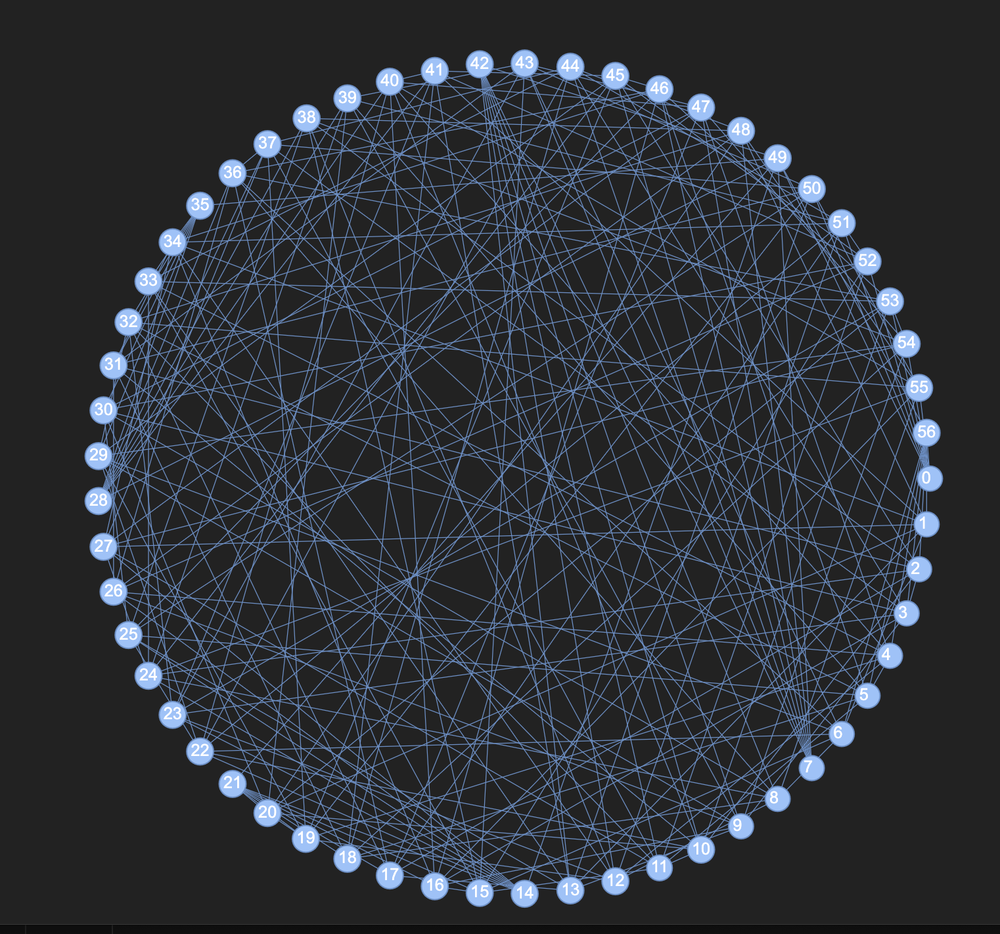

## Radix 8 XRd Polarfly Topology

This project is setup to deploy a radix 8 XRd Polarfly topology, which results in a 57 node Polarfly single tier network. The setup uses Containerlab as topology orchestrator and leverages the Containerlab VXLAN tool to connect nodes across host servers or VMs.

### Requirements:

Two Linux servers or large VMs with 32 vCPU and 96GB RAM each. This project has been tested on Ubuntu 22.04.

Other requirements: Docker and Containerlab

### Instructions:

1. Clone this repository

2. Install Containerlab: https://containerlab.dev/install/

3. Acquire a Cisco XRd router image

4. Load docker image
```
docker load -i <image_name>
```

1. Modprobe
```
sudo modprobe br_netfilter
```

1. Add the following to /etc/sysctl.conf
```
kernel.pid_max=1048575
net.vrf.strict_mode=1
net.ipv4.ip_forward=1
net.ipv6.conf.all.forwarding=1

fs.inotify.max_user_watches = 131072
fs.inotify.max_user_instances = 131072
net.bridge.bridge-nf-call-iptables = 1
net.bridge.bridge-nf-call-ip6tables = 1
kernel.pid_max = 1048575
```

7. Apply sysctl changes
```
sudo sysctl -p
```

8. Determine which server/VM will host the lower half of the topology (nodes00 - nodes28) and which will host the upper half (nodes29 - nodes57). 

9. On the lower half server/VM, cd into the xrd directory then:
    
Deploy lower nodes:
```
sudo clab deploy -t polarfly-lower.yml
```

10. On the upper half server/VM, cd into this directory then:

Deploy upper nodes:
```
sudo clab deploy -t polarfly-upper.yml
```

11. Give the routers 1-2 minutes to launch, then proceed to the next step

#### The current version of containerlab appears to have a bug where some nodes' netns connections are erroneously allocated. Perform the following steps on both upper and lower servers/VMs to fix the issue.

1. cd into the util directory and run the `*find-ints.sh*` script, which will give a list of error connections
```
cd util
sudo ./find-ints.sh
```

2.  Run the `*fix-ints.sh*` script, which will clean up the errors
```
sudo ./fix-ints.sh
```

3.  Run vxlan interconnect scripts:

Lower nodes:
```
sudo ./vxlan-lower.sh
```

Upper nodes:
```
sudo ./vxlan-upper.sh
```

The containerlab connections both within the servers/VMs and across the vxlan interconnects should now be up

### Verify nodes are up and BGP sessions are established
   
1.  ssh to routers. Example:
```
ssh cisco@clab-polarfly-radix8-node55
password: cisco123
```

2. BGP sessions should be established. Example:
```
show bgp ipv6 unicast summary
```

You should now have a working topology that looks something like this:


